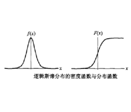

# Attention Is All You Need

**Attention**
$$
\text{Attention}(Q,K,V) = \text{softmax}(\frac{Q K^T}{\sqrt{d_k}})V
$$
其中$Q,K \in R^{\cdot × d_k}$, $V \in R^{\cdot × d_v}$. 对于不同的attn层, $Q,K,V$ 由来如下:

- 对于 encoder 的 attn, $Q=XW^q, K=XW^k, V=XW^v$
- 对于 decoder 的 masked attn, 三者均来自于上个 $t$ 时刻的输出 $h_{decoder}^t$ 分别做类似第1步的操作所得
- 对于 decoder 的 Encoder-Decoder Attn, $K,V$来自于 encoder 的最后输出的 $h_{encoder}^L$ 做第1步的操作所得, 而 $Q$ 来于 decoder 的前一层的输出

**Multi-head Attn**
$$
\begin{split}
\text{MultiHead}(Q,K,V) &= \text{Concat{head$_1,\dots,$head$_h$}} W^O \\
其中\text{head}_i &= \text{Attention}(QW_i^Q, KW_i^K, VW_i^V)
\end{split}
$$
其中 $W_i^Q \in R^{d_{model} × d_k}, W_i^K \in R^{d_{model} × d_k}, W_i^V \in R^{d_{model} × d_v}, W_i^O \in R^{hd_v× d_{model}}$

**Position-wise Feed-Forward Networks**
$$
\text{FFN}(x) = \max(0, xW_1 + b_1) W_2 + b_2
$$
**Each sub-layer**
$$
y = \text{LayerNorm}(x + \text{Sublayer}(x))
$$
**Positional Encoding**
$$
\begin{split}
\text{PE}_{(pos, 2i)} = \sin(pos / 10000^{2^i / d_{model}}) \\
\text{PE}_{(pos, 2i+1)} = \cos(pos / 10000^{2^i / d_{model}}) 
\end{split}
$$


# Improving Language Understanding by Generative Pre-Training

给定unlabeled corpus $\mathcal{U}=\{u_1,\dots,u_2\}$, 优化如下**standard language modeling objective**:
$$
L_1(\mathcal{U}) = \max_{\Theta}\sum_i\log P(u_i|u_{i-k},\dots,u_{i-1};\Theta)
$$
其中$k$是 context window的大小, $P(\cdot)$如下:
$$
\begin{split}
h_0 &= U W_e + W_p \\
h_i &= \text{Transformer_block}(h_{i-1}), \ \ \forall i \in [1,n] \\
P(u) &= \text{softmax}(h_n W_e^T)
\end{split}
$$
其中$U=\{u{-k},\dots,u_{-1}\} \in R^{k×d}$ 是 context vector of tokens (每个$u$即为一个one-hot向量, $d$表示字典的大小), $n$是multi-layer Transformer的层数(即每个Transformer_block为一层Transformer), $W_e \in R^{d × s}$是token embedding matrix, $W_p$是position embedding embedding matrix


给定 target task 里的 labeled dataset $\mathcal{C}=\{(x,y)\}$, 其中 $x=<x^1,\dots,x^m>$是 a sequence of input tokens, $y$ 是 label, 则优化如下目标:
$$
\begin{split}
L_2(\mathcal{C}) &= \max_{W_y}\sum_{(x,y)}\log P(y|x^1,\dots,x^m) \\
&= \max_{W_y}\sum_{(x,y)}\text{softmax}(h_n W_y)
\end{split}
$$
实验发现若该优化目标添加上 language modeling 的话, 有助于提高 supervised model 的泛化性, 同时能加速收敛. 因此最终的优化目标为:
$$
L3(\mathcal{C}) = L_2(\mathcal{C}) + \lambda L_1(\mathcal{C})
$$
注意, 整个过程仅fine tune $W_y$ 以及 embeddings for delimiter tokens

# Generating Text via Adversarial Training

$$
\text{soft-argmax}(x) = \sum_i \frac{\exp{\beta x_i}}{\sum_j \exp{\beta x_j}}i
$$

其中 $i$ 表示 $x_i$ 所在的下标, $\beta$ 是一个矢量缩放因子, 起放大最大值而相对抑制其它值影响的作用. 理论上, $\beta$ 越大, $\text{soft-argmax}$ 的估值就越接近 $\text{argmax}$ 的真实值. $\text{soft-argmax}$ 的一个好处是连续可导

# SeqGAN

**generator的优化目标**
$$
\begin{split}
J(\theta) &= \max_{\theta} \Bbb E[R_T|s_1,\theta] \\
               &= \max_{\theta} \Bbb E_{Y_{1:t-1} \sim G_{\theta}} \left[\sum_{y_t \in \mathcal{Y}} G_{\theta}(y_t|Y_{1:t-1}) \cdot Q_{D_\phi}^{G_{\theta}}(Y_{1:t-1},y_t) \right] \\
\nabla_{\theta} J(\theta) &= \Bbb E_{Y_{1:t-1} \sim G_{\theta}} \left[\sum_{y_t \in \mathcal{Y}} \nabla_{\theta} G_{\theta}(y_t|Y_{1:t-1}) \cdot Q_{D_\phi}^{G_{\theta}}(Y_{1:t-1},y_t) \right] \\
               &\approx \frac{1}{T} \sum_{t=1}^T \Bbb E_{y_t \sim G_{\theta}(y_t|Y_{1:t-1})} \left[ \nabla_{\theta} \log G_{\theta}(y_t|Y_{1:t-1}) \cdot Q_{D_\phi}^{G_{\theta}}(Y_{1:t-1},y_t) \right]
\end{split}
$$
其中 $R_T$ 表示判别器 $D_{\phi}$ 对以 $s_1$ 为 start state 的生成的完整序列 $T$ 的评估值, 即 reward; $Y_{1:t} = \{y_1,\dots,y_t\}$ 表示当前状态序列; $G_{\theta}$ 表示 generator (即为policy net) 在给定当前状态 $Y_{1:t-1}$下输出的关于 action 的概率分布; $Q_{D_{\phi}}^{G_{\theta}}$ 为 action-value 函数, 表示在当前状态下采取动作 $y_t$ 后所达到的新状态 $Y_{1:t}$ 所具备的价值/潜力, 该项用于衡量 intermediate state 的潜力值, 具体计算如下:
$$
Q_{D_{\phi}}^{G_{\theta}}(s=Y_{1:t-1}, a=y_t)=\begin{cases}
\frac{1}{N} \sum_{n=1}^N D_{\phi} (Y_{1:T}^n), & Y_{1:T}^n \in \text{MC}^{G_{\beta}}(Y_{1:t}; N)\ \text{for}\ t<T \\[.4em]
D_{\phi} (Y_{1:T}), &\ \text{for}\ t=T
\end{cases}
$$
其中 $\text{MC}^{G_{\beta}}(Y_{1:t}; N)=\{Y_{1:T}^1,\dots,Y_{1:T}^2\}$ 表示在当前的 state node $Y_{1:t}$ 上, 采用策略网络 $G_{\beta}$, 随机模拟仿真(即采用roll-out policy) $N$ 次, 每次随机采样 $T-t$ 个 token, 从而最终得到 $N$ 个完整序列

**discriminator的优化目标**
$$
\min_{\phi} - \Bbb E_{Y \sim P_{data}}[\log D_{\phi}(Y)] - \Bbb E_{Y \sim G_{\theta}}[\log (1 - D_{\phi}(Y))]
$$

# RelGAN: Relational Generative Adversarial Network for Text Generation

**relational memory (multi-head) 的更新**
$$
\begin{split}
M_{t+1} &= f_{\theta_1}(\tilde M_{t+1}, M_t) \\
o_t &= f_{\theta_2}(\tilde M_{t+1}, M_t) \\
\text{where}\ &\ \tilde M_{t+1} = [\tilde M_{t+1}^{(1)}:\cdots:\tilde M_{t+1}^{(H)}] \\
&\  \tilde M_{t+1}^{(h)} = \text{softmax}\left( \frac{Q^{(h)}K^{(h)T}}{\sqrt{d_k}} \right) V^{(h)} \\
&\ Q^{(h)} = M_t W_q^{(h)} \\
&\ K^{(h)} = [M_t; x_t] W_k^{(h)} \\
&\ V^{(h)} = [M_t; x_t] W_v^{(h)}
\end{split}
$$
其中 $x_t \in R^{1×d}$ 表示在 $t$ 时刻的输入, $\tilde M_t \in R^{N×d}$ 的每个行向量即为一个缓存槽, $[;]$ 表示row-wise concatenation(即列数不改变, 行数改变), $d_k$ 为 $K^{(h)} \in R^{(N+1)×d_k}$ 的列数($Q^{(h)} \in R^{N×d_k}, V^{(h)} \in R^{(N+1)×d}$), $o_t$ 是 output (logits) ot of the generator at time $t$, $f_{theta_1}和f_{\theta_2}$分别为 combinations of skip connections, multi-layer perceptron (MLP), gated operations and/or pre-softmax linear transformations.

**Gumbel-Softmax**
$$
\begin{aligned}
	y_{t+1} &\sim \text{sample}(\text{softmax}(o_t)) \\
	~ & \downarrow_{\text{Gumbel-Max}} \\
	y_{t+1} &= \text{onehot}(argmax_{1 \leq i \leq V} (o_t^i + g_t^i) \\
	~ & \downarrow_{\text{Gumbel-Softmax}} \\
	\hat{y}_{t+1} &= \text{softmax} ((o_t + g_t) / \gamma)
\end{aligned}
$$
其中 $o_t, g_t \in R^V$, $g_t^i = -\log(-\log(U_t^i)), U_t^i \sim \text{Uniform(0,1)}$ 是 gumbel 噪声, $\gamma > 0$ 是温度参数( temperature) 或$\frac{1}{\gamma}$是逆温差(inverse temperature), $\gamma \downarrow \implies \hat{y}_{t+1} \to y_{t+1} \wedge \text{梯度消失越严重}$. 

对于 generator / discriminator 来说, 均使用 $\hat y_{t+1}$ 替代 $y_{t+1}$ 作为输入, 其中 generator 的输入具体为 $x_{t+1} = \text{Linear}(\text{Embedding}(\hat y_{t+1}))$

**Temperature control**

文章指出, 若逆温度参数 $\frac{1}{\gamma}$  越大, $\hat y$ 的分布会越尖锐, 若概率最大的是噪声, 则会很容易采样到噪声, 因此 generator 对噪声越敏感. 直觉上,  对噪声越敏感, 则越可能生成与数据集不一样的数据, 故文章称这有利于**more exploration for better sample diversity**, 但同时也可能会导致poor sample quality; 而 $\frac{1}{\gamma}$ 越小, $\hat y$ 的分布会相对平缓, 即 $\hat y$ 与 $y$ 的差异大, 但受噪声的干扰相对较小, 因此 generator 会趋于拉小 $\hat y$ 和 $y$ 的差距, 从而生成更 realistic 的数据, 故文章称会这有利于**more exploitation for better sample quality**

文章采用 **exponential policy** 来自动调控 $\beta=\frac{1}{\gamma}$ 的大小:
$$
\beta_n = \beta_{max}^{n / N}
$$
其中 $n,N$ 分别表示当前epoch和最大epoch. $\beta_{max}$ 为超参, 该值大时偏向于 **exploration**(即多样性), 反之则为 **exploitation**(即样本质量)


# Combining Fact Extraction and Verification with Neural Semantic Matching Networks

**Encoding Layer**

使用 $\text{BiLSTM}$ 用于将上下文信息编码到token中:
$$
\begin{aligned}
\overline U &= \text{BiLSTM}(U) \in \mathbb R^{d_1 \times n} \\
\overline V &= \text{BiLSTM}(V) \in \mathbb R^{d_1 \times m} 
\end{aligned}
$$
其中 $U \in \mathbb R^{d_0 \times n}, V \in \mathbb R^{d_0 \times m}$ 分别表示两个长度分别为 $n, m$ 的input token sequences, $d_0, d_1$ 分别表示输入和输出维度

**Alignment Layer**
$$
\begin{array}{crcl}
\text{alignment score matrix} & E &=& \overline U^T \overline V \in \mathbb R^{n \times m} \\
~ & ~ & \downarrow & \\
\text{‘attn representation’} & \widetilde U &=& \overline V \cdot \text{softmax}(E^T) \in \mathbb R^{d_1 \times n} \\
~ & \widetilde V &=& \overline U \cdot \text{softmax}(E) \in \mathbb R^{d_1 \times m} \\
~ & ~ & \downarrow & \\
\text{aligned representation} & S &=& f([\overline U, \widetilde U, \overline U - \widetilde U, \overline U \circ \widetilde U]) \in \mathbb R^{d_2 \times n} \\
~ & T &=& f([\overline V, \widetilde V, \overline V - \widetilde V, \overline V \circ \widetilde V]) \in \mathbb R^{d_2 \times m} 
\end{array}
$$
其中 $\cdot, \circ$ 分别表示矩阵内积/点乘和按位乘法, $f = \text{ReLu(Linear($\cdot$))}$

**Matching Layer**
$$
\begin{aligned}
P &= \text{BiLSTM}([S, U^*]) \in \mathbb R^{d_3 \times n} \\
Q &= \text{BiLSTM}([T, V^*]) \in \mathbb R^{d_3 \times m}
\end{aligned}
$$
其中 $U^*, V^*$ 是 sub-channels of the input $U$ and $V$ without GloVe, 加入该项的目的是为便于训练

**Output Layer**
$$
\begin{aligned}
p &= \text{Maxpool}_{row}(P) \in \mathbb R^{d_3} \\
q &= \text{Maxpool}_{row}(Q) \in \mathbb R^{d_3} \\
m &= h(p, q, |p-q|, p \circ q)
\end{aligned}
$$
其中 $h = \text{Linear(ReLu(Linear($\cdot$)))}$. 对于 extraction 子任务(document retrieval & sentence selection), $m = <m^+, m^->$, 其中 $m^+$ 表示选择当前sentence作为evidence的得分, $m^-$ 则相反; 对于 claim verification, $m = <m_s, m_r, m_n>$ 分别表示 $Supported, Refute, NEI$ 的得分

**Document Retrieval**
$$
\begin{aligned}
\langle m^+, m^-  \rangle &= \text{NSMN}(c_i, [t_j, s_j^0]) \\
p(x=1|c_i, j) &= \frac{\exp(m^+)}{\exp(m^+) + \exp(m^-)}
\end{aligned}
$$
其中 $c_i$ 表示第 $i$ 个 claim; $[t_j, s_j^0]$ 表示第 $j$ 个 document 对应的 title 和 first sentence; $x \in \{0, 1\}$ 表示 claim 与 document 是否相关;$m^+$ 为 global semantic relatedness of a document to a claim, 该值越高, 表示相关性越大 (全局可比较)

# SinGAN

**Generator**
$$
\begin{aligned}
\tilde{x}_N &= G_N(z_N) \\
\tilde{x}_n &= G_n(z_n, (\tilde{x}_{n+1}) \uparrow^r)\\
	&= (\tilde{x}_{n+1}) \uparrow^r + \psi_n(z_n + (\tilde{x}_{n+1}) \uparrow^r),\, n = 0,\cdots,N-1
\end{aligned}
$$
其中 $\psi_n$ 是一个由5个 $\text{conv-block}$ 构成的卷积网络，每个 $\text{conv-block}$ 为 $\text{Conv(3×3)-BatchNorm-LeakyReLU}$ ，其中在 coarsest scale 中卷积核个数为32，每隔4个scale则翻倍；$z_n$ 是从正态分布中采样的噪声图；$\uparrow^r$ 表示上采样 $r$ 倍

# 统计学习

$$
L(L,f(x)) = \begin{cases}
1, & f(x) \neq Y \\
0, & f(x) = Y
\end{cases} \\
L(L,f(x)) =(Y - f(X)^2 \\
L(L,f(x)) = |Y - f(X)| \\
L(L,f(x)) = -\log P(Y|X) \\
R_{exp}(f) = E_P[L(Y, f(X))] = \int_{\mathcal{X×Y}} L(y, f(x)) P(x, y) dx dy \approx \frac{1}{N} \sum_{i=1}^N L(y_i, f(x_i))
$$

$$
f(x) = \text{sign}(wx+b)
$$

其中 $w \in R^n$ 为权值/权值向量(weight), $b \in R$ 为偏置(bias), sign为符号函数

点 $x_0$ 到超平面 $wx+b=0$ 的距离公式为 $\frac{1}{\|w\|_2}|wx_0+b|$.  

给定误分类的点集$\mathcal{X}_{neg}$, 对于$\forall x_i \in \mathcal{X}_{neg}$, 它到超平面的距离 $-\frac{1}{\|w\|_2} y_i (wx_i+b) > 0$. 因此$\mathcal{X}_{neg}$ 到超平面的距离为 $-\frac{1}{\|w\|_2} \sum_{(x_i, y_i) \in \mathcal{X}_{neg}}y_i (wx_i+b) > 0$. 由于对任意误分类点, 距离公式里的 $\|w\|_2$ 是相同的, 故去除该项不改变距离的相对大小 , 因此感知机的损失函数定义为:
$$
L(w,b) = \min_{w, b} -\sum_{(x_i, y_i) \in \mathcal{X}_{neg}} y_i (wx_i+b) > 0
$$

KNN

input:

- 数据集$T=\{(x_1,y_1),\dots,(x_N,y_N)\}$, 其中 $x_i \in \mathcal{X} \in R^n, y_i \in \mathcal{Y} = \{c_1,\dots,c_K\}$
- 查询的特征向量$x \notin \mathcal{X}$

output: $x$ 的类别

alg:

1. 根据给定的距离度量, 从 $T$ 中找出与 $x$ 最接近的 $k$ 个点, 记为 $N_k(x)$

2. 在 $N_k(x)$ 中根据分类决策规则(如多数投票)决定 $x$ 的类别 $y$: 
   $$
   y = \arg\max_{c_j} \sum_{x_i \in N_k(x)} 1(y_i = c_j), i = 1,\dots,N; j=1,\dots,K
   $$
   

贝叶斯理论
$$
\begin{split}
P(Y=c_k|X=x) &= \frac{P(X=x,Y=c_k)}{P(X=x)} \\
	&= \frac{P(X=x|Y=c_k) P(Y=c_k)}{\sum_j P(X=x|Y=c_j) P(Y=c_j)}
\end{split}
$$
条件独立假设
$$
\begin{split}
P(X=x|Y=c_k) &= P(X^1=x^1,\cdots,X^n=x^n|Y=c_k) \\
	&= \prod_{j=1}^n P(X^j=x^j|Y=c_k)
\end{split}
$$
其中 $x \in R^n$

**朴素贝叶斯基本公式**
$$
\begin{split}
P(Y=c_k|X=x) &= \frac{P(X=x|Y=c_k) P(Y=c_k)}{\sum_j P(X=x|Y=c_j) P(Y=c_j)} \\
	&=  \frac{P(Y=c_k) \prod_{j=1}^n P(X^j=x^j|Y=c_k)}{\sum_j P(Y=c_k) \prod_{i=1}^n P(X^i=x^i|Y=c_j)}
\end{split}
$$
**朴素贝叶斯分类器**
$$
\begin{split}
y = f(x) &=  \arg\max_{c_k} \frac{P(Y=c_k) \prod_{j=1}^n P(X^j=x^j|Y=c_k)}{\sum_j P(Y=c_k) \prod_{i=1}^n P(X^i=x^i|Y=c_j)} \\
&=  \arg\max_{c_k} P(Y=c_k) \prod_{j=1}^n P(X^j=x^j|Y=c_k) \\
&\text{(由于式中的分母对所有$c_k$都是一样的, 因此可忽略分母)} \\
& \left(\begin{split}
	= &\arg\max_{c_k} P(Y=c_k) P(X=x|Y=c_k) \\
	= &\arg\max_{c_k} P(X=x, Y=c_k) \\
	& \text{这也是为何说朴素贝叶斯是通过训练集来学习联合分布$P(X,Y)$的原因}
    \end{split}\right)
\end{split}
$$
令 $L(Y, f(X))$ 表示0-1损失函数, 其中 $Y=\{c_1,\dots,c_K\}, f(X)$ 分别表示 true class 和 predict class, 故期望风险为:
$$
\begin{split}
R_{exp}(f) &= \Bbb E_{x \sim X} \sum_{k=1}^K [L(c_k, f(x))] P(f(x)=c_k|X=x) \\
\therefore\ \ \ \ \ \ \ \ \  &\text{为使得期望风险最小化, 只需对$X=x$逐个最小化} \\
\text{即}\ f^*(x) &= \arg\min_f \sum_{k=1}^K [L(c_k, f(x))] P(f(x)=c_k|X=x) \\
      &= \arg\min_f \sum_{k=1}^K P(c_k \neq f(x)|X=x) \\
      &= \arg\min_f (1 - P(c_j = f(x)|X=x)) \ \ \ \text{(假定$x$的真实类别为$c_j$)}\\
      &=  \arg\max_f P(c_j = f(x)|X=x) \\
      &=  \arg\max_f P(Y=c_j|X=x) \\
\therefore f^*(X) &= \arg\max_f P(Y=c_j|X=x)\ \ \ \text{即期望风险的最小化就得到了后验概率的最大化}
\end{split}
$$
**朴素贝叶斯算法**

Input:

- 训练数据 $T=\{(x_1,y_1),\dots,(x_N,y_N)\}$, 其中 $x_i = (x_i^1,\dots,x_i^n)^T \in R^n, x_i^j \in \{c_{j1},\dots,c_{jS_j}\}$. 即每个特征值 $x^j$ 对应的值域是已知的 (这点对朴素贝叶斯非常重要, 否则无法计算——根据朴素贝叶斯分类器公式理解)
- 查询实例 $x \in R^n$

Output: $x$ 的类别

Alg:

1. 计算先验概率及条件概率(采用极大似然估计, 即下式)
   $$
   \begin{split}
   P(Y=c_k) &= \frac{\sum_{i=1}^N 1(y_i = c_k)}{N}\ \ \text{for}\ \ k=1,\dots,K \\
   P(X^j=a_{jl}|Y=c_k) &= \frac{\sum_{i=1}^N 1(x_i^j=a_{jl}, y_i=c_k)}{\sum_{i=1}^N 1(y_i=c_k)}
   \end{split} \\
   \text{for}\ \ j=1,\dots,n; l=1,\dots,S_j; k=1\dots,K
   $$

2. 对于给定的实例 $x = (x^1,\dots,x^n)$, 计算
   $$
   P(Y=c_k) \prod_{j=1}^n P(X^j=x^j|Y=c_k) \ \ \text{for}\ \ k=1,\dots,K
   $$

3. 确定 $x$ 的类
   $$
   y = \arg\max_{c_k} P(Y=c_k) \prod_{j=1}^n P(X^j=x^j|Y=c_k)
   $$


**贝叶斯估计**
$$
\begin{split}
P(X^j=a_{jl}|Y=c_k) &= \frac{\sum_{i=1}^N 1(x_i^j=a_{jl}, y_i=c_k)}{\sum_{i=1}^N 1(y_i=c_k)} \\
	&\to \frac{\sum_{i=1}^N 1(x_i^j=a_{jl}, y_i=c_k) + \lambda}{\sum_{i=1}^N 1(y_i=c_k) + S_j \lambda} \\
P(Y=c_k) &= \frac{\sum_{i=1}^N 1(y_i = c_k)}{N} \\
	&\to \frac{\sum_{i=1}^N 1(y_i = c_k) + \lambda}{N + K \lambda}
\end{split}
$$
其中 $S_j$ 为第 $j$ 个特征 $x^j$ 的可能取值个数, $K$ 表示类别数量

**信息增益算法**

Input: 训练数据集 $D$ 和特征 $A$

Output: $g(D, A)$

Alg:

1. 计算数据集 $D$ 的经验熵 $H(D)$
   $$
   H(D) = - \sum_{k=1}^K \frac{|C_k|}{D} \log \frac{|C_k|}{|D|}
   $$
   其中 $C_k$ 表示在数据集 $D$ 中类别为 $k$ 的样本集

2. 计算给定特征 $A$ 下 $D$ 的经验条件熵 $H(D|A)$
   $$
   H(D|A) = \sum_{i=1}^n \frac{|D_i|}{|D|} H(D_i)
   $$
   其中 $D_i$ 表示在数据集 $D$ 中特征 $A$ 的取值为 $i$ 的样本集

3. 计算信息增益 $g(D, A)$
   $$
   g(D, A) = H(D) - H(D|A)
   $$
   

**信息增益比**: 为信息增益 $g(D,A)$ 与训练数据 $D$ 关于特征 $A$ 的值的熵 $H_A(D)$ 之比,
$$
g_r(D,A) = \frac{g(D, A)}{H_A(D)}
$$
其中 $H_A(D) = -\sum_{i=1}^n \frac{|D_i|}{|D|} \log_2\frac{|D_i|}{|D|}$, $n$ 是特征 $A$ 的取值个数

**ID3**

Input: 训练数据集 $D$, 特征集 $A$ , 阈值 $\epsilon$

Output: 决策树 $T$

Alg:

1. 若 $D$ 中所有实例属于同一类 $C_k$, 则 $T$ 为单结点树, 并将类 $C_k$ 作为该结点的类标签, 返回 $T$
2. 若 $A = \empty$, 则 $T$ 为单结点树, 并将 $D$ 中实例数最大的类 $C_k$ 作为该结点的类标记, 返回 $T$
3. 若 $A \neq \empty$, 则计算 $A$ 中各个特征对 $D$ 的信息增益, 选择信息增益最大的特征 $A_g$, 记为 $g_r(D, A_g)$
4. 若 $g_r(D, A_g) < \epsilon$, 则置 $T$ 为单结点树, 并将 $D$ 中实例数最大的类 $C_k$ 作为该节点的类标记, 返回 $T$
5. 若 $g_r(D, A_g) \geq \epsilon$, 对 $A_g$ 的不同取值将 $D$ 划分为若干非空子集 $D_i$, 每个 $D_i$ 对应一个子结点. 由节点及其子结点构成树 $T$, 返回 $T$
6. 遍历每个子结点: 对第 $i$ 个子结点, 以 $D_i$ 为训练集, 以 $A \backslash A_g$ 为新特征集, 递归调用 1~5, 得到子树 $T_i$, 返回 $T_i$

**决策树学习的损失函数**

设树 $T$ 的**叶节点**个数为 $|T|$, $t$ 是 $T$ 的叶节点, 该节点由 $N_t$ 个样本点, 其中 $k$ 类的样本点有 $N_{tk}$ 个 ($k=1,2,\cdots,K$), $H_t(T)$ 为叶节点 $t$ 上的经验熵, $\alpha \geq 0$ 为参数, 则决策树学习的损失函数为:
$$
C_{\alpha}(T) = \min \sum_{t=1}^{|T|} N_t H_t(T) + \alpha |T|
$$
其中经验熵
$$
H_t(T) = -\sum_k \frac{H_{tk}}{N_t} \log \frac{H_{tk}}{N_t}
$$
记
$$
C(T) = \sum_{t=1}^{|T|} N_t H_t(T) = - \sum_{t=1}^{|T|} \sum_{k=1}^K N_{tk} \log \frac{N_{tk}}{Nt} (=-\log \prod_{t=1}^{|T|} \prod_{k=1}^K (\frac{N_{tk}}{N_t})^{N_{tk}})
$$
其中 $C(T)$ 表示模型对训练数据的预测误差, 即模型与训练数据的拟合程度, $|T|$ 表示模型复杂度. 较大的$\alpha$ 促使较简单的树, 反之则较复杂. **$\sum_t H_t(T)$ 是数据集在 $T$ 的划分下的总体熵值, 最小化 $C_{\alpha}$ 的目的是找出模型复杂度 $|T|$ 小, 同时总体熵值小的模型**

根据上式 $C(T) =-\log \prod_{t=1}^{|T|} \prod_{k=1}^K (\frac{N_{tk}}{N_t})^{N_{tk}}$ 可看出, **损失函数的极小化等价于正则化的极大似然估计**, 即, 利用损失函数最小原则进行剪枝就是用正则化的极大似然估计进行模型选择

**树的剪枝算法**

Input: 生成算法产生的整个树 $T$, 参数 $\alpha$

Output: 修剪后的子树 $T_{\alpha}$

1. 计算每个结点的经验熵 (注意不是叶子结点)

2. 递归地从树的叶节点向上回缩, 即:

   设一组叶节点回缩到其父结点之前与之后的整体树分别为 $T_B$ 与 $T_A$($|T_A| < |T_B|$),  其对应的损失函数值分别是 $C_{\alpha}(T_B)$ 与 $C_{\alpha}(T_A)$, 若
   $$
   C_{\alpha}(T_A) \leq C_{\alpha}(T_B)
   $$
   则进行剪枝, 即将父结点变为新的叶节点

   (**即"浓缩"的条件是: , $|T_A| < |T_B| \and C_{\alpha}(T_A) \leq C_{\alpha}(T_B)$, 即当模型复杂度和总体熵值均更小时才"浓缩", 这符合 $C_{\alpha}$ 的优化方向**)

3. 返回(2), 直至不能继续为止, 得到损失函数最小的子树 $T_{\alpha}$


###  CART

**最小二乘回归树**

Input: 训练集 $D = \{ (x_i, y_i): i=1,\cdots,N \}$

Output: 回归树 $f(x)$

Process: 在 $D$ 所在的输入空间中, 递归地将每个区域划分为两个子区域(即结点)并决定每个子区域上的输出值, 构建**二叉决策树**

Alg:

1.  选择最优切分变量 $j$ (即第 $j$ 个特征 $X^{(j)}$) 与切分点 $s$ (即切分变量 $j$ 对应的取值), 求解
$$
   \begin{aligned}
   ~ &\min_{j, s} \left[ \overbrace{\min_{c_1} \sum_{x_i \in R_1(j, s)} (y_i - c_1)^2}^{\text{最小二乘法}} + \overbrace{\min_{c2} \sum_{x_i \in R_2(j, s)} (y_i - c_2)^2}^{最小二乘法} \right] \\
   \text{s.t.}\ &\ R_i(j,s) = \{ x|x^{(j)} \leq s \},\ R_2(j,s) = \{ x|x^{(j)} > s \}
   \end{aligned} \label{(1)}
$$
   即变量变量 $j$, 对固定的切分变量 $j$ 扫描切分点 $s$, 选择使得上式达到最小值的对 $(j, s)$. $[\cdot]$ 里即通过最小二乘法选择距离 $R_1/R_2$ 最近的直线

2. 用选定的对 $(j, s)$ 划分区域并决定该区域的输出值
   $$
   R_i(j,s) = \{ x|x^{(j)} \leq s \},\ R_2(j,s) = \{ x|x^{(j)} > s \} \\
   \hat c_m = \frac{1}{N_m} \sum_{x_i \in R_m(j, s)} y_i = \text{avg}(y_i|x_i \in R_m),\ x \in R_m,\ m=1,2
   $$

3. 继续对两个子区域调用步骤(1),(2), 指导满足停止条件

4. 将输入空间划分为 $M$ 个区域 $R_1, \cdots, R_M$(每个区域其实对应决策树上的一个叶节点), 生成决策树:
   $$
   f(x) = \sum_{m=1}^M \hat c_m 1(x \in R_m)
   $$
   其中 $\hat c_m$ 即表示第 $m$ 个区域/叶结点对应的均值

**基尼指数**

分类问题中, 假设有 $K$ 个类别, 样本点属于第 $k$ 类的概率为 $p_k$, 则概率分布的基尼指数定义为
$$
\text{Gini}(p) = \sum_{k=1}^K p_k (1  - p_k) = 1 - \sum_{k=1}^K p_k^2
$$
对于给定的样本集合 $D$, 其基尼指数为
$$
\text{Gini}(D) = 1 - \sum_{k=1}^K \left( \frac{|C_k|}{|D|} \right)^2
$$
其中 $C_k$ 是 $D$ 中属于第 $k$ 类的样本子集, $K$ 是类的个数

若 $D$ 经过特征 $A$ 是否取某亦可能值 $a$ 被分割为 $D_1$ 和 $D_2$ 两部分, 即
$$
D_1 = \{(x,y) \in D | A(x) = a\}, D_2 = D \backslash D_1
$$
则在特征 $A$ 的条件下, $D$ 的基尼指数为
$$
\text{Gini}(D) = \sum_{i=1}^2 \frac{|D_i|}{D} \text{Gini}(D_i)
$$
**$\text{Gini}(D)$ 表示 $D$ 的不确定性, $\text{Gini}(D, A)$ 表示经 $A=a$ 分割后 $D$ 的不确定性. 基尼指数越大, 样本集合的不确定性就越大**

**CART生成算法**

Input: 训练数据集 $D$, 停止计算的条件 (结点中样本个数小于给定阈值/样本集的基尼指数小于给定阈值(此时样本基本属于同一类)/没有更多特征)

Output: CART 决策树

Alg: 根据 $D$, 从根节点开始, 递归地对每个结点进行如下操作, 构建二叉决策树

1. 设结点的训练数据集为 $D$, 计算现有特征对该数据集的基尼指数, 即, 对每个特征 $A$, 对其可能取的每个值 $a$, 根据样本点对 $A=a$ 划分为"是"或"否"两个数据集 $D_1$ 和 $D_2$, 并计算基尼指数 $\text{Gini}(D, A)$
2. 在所有可能的特征 $A$ 以及它们所有可能的切分点 $a$ 中, 选择基尼指数最小对应的特征及且切分点作为最优特征与最优切分点 $a$. 依最优特征与最优切分点, 从现有结点生成两个子节点, 将训练数据集依特征分配到两个子结点中(注意子结点的特征集依旧为 $A$)
3. 对两个子结点递归地调用(1),(2), 直至满足停止条件
4. 生成 CART 决策树

**CAER剪枝**

Input: CART 算法生成的决策树 $T_0$

Output: 最优策略树 $T_{\alpha}$

Alg:

```python
# 一 获取最优子树序列
Ts = [T_0] # 最优子树序列
while True:
    T = Ts[-1] # 获取上次最优子树
    alpha = 无穷大
    # [1] 自下而上遍历每个内部节点 t, 获取 T 的最小 alpha
    for t in InterNode(T):
        # T_t 表示以 t 为根结点的子树, C(T_t) 是对训练数据的预测误差, 如基尼指数
        # |T_t| 表示 T_t 的叶结点个数
        g(t) = (C(t) - C(T_t)) / (|T_t| - 1)
        alpha = min(alpha, g(t))
    # [2] 对 alpha 对应的内部结点 t 进行剪枝, 并对叶结点 t 以多数表决法决定其类别,
    # 得到当前最优子树 T
    T = 根据 alpha 对应的 t 对 T 进行剪枝
    Ts.append(T)
    if T 是由根结点及两个叶结点构成的树: break
# 二 采用交叉校验法在子树序列 Ts 中选取最优子树 T_{alpha}
```

## logistics 回归与最大熵模型

**Logistic 回归**

**logistic distribution**:

设 $X$ 是连续随机变量, 且服从 logistic distribution, 即 $X$ 具有下列分布函数和密度函数:
$$
\begin{aligned}
F(x) &= P(X \leq x) = \frac{1}{1 + \exp(-(x - \mu) / \gamma)} \\
f(x) &= F'(x) = \frac{\exp(-(x - \mu) / \gamma)}{\gamma \cdot (1 + \exp(-(x - \mu) / \gamma))^2} \\
~ &= \frac{1}{\gamma} F(x)(1 - F(x))
\end{aligned}
$$
其中 $\mu$ 为位置参数, $\gamma > 0$ 为形状参数

$F(x)$ 是一条 S 形曲线 (sigmoid curve), 该曲线以点 $(\mu, \frac{1}{2})$ 中心对称, 且形状参数 $\gamma$ 越小, 曲线在中心附近增长得越快



**binomial logistic regression model**

binomial logistic regression model 是如下的条件概率分布:
$$
\begin{aligned}
P(Y=1|x) &= \frac{exp(w \cdot x + b)}{1 + \exp(w \cdot x + b)} = \frac{exp(\hat w \cdot \hat x)}{1 + \exp(\hat w \cdot \hat x)} \\
P(Y=0|x) &= \frac{1}{1 + \exp(w \cdot x + b)} = \frac{1}{1 + \exp(\hat w \cdot \hat x)}
\end{aligned}
$$


一个事件的几率 (odds) 是指该事件发生的概率与不发生的概率的比值, 而对数几率 (log odds) 则是对几率取 log 值. 因此对于 logistic regression 而言, 其对数几率为:
$$
\text{logit}(p) = \log\frac{P(Y=1|x)}{P(Y=0|x)} = \hat w \cdot \hat x
$$
即在 logistic regression model 中, 输出 $Y=1$ 的对数几率是输入 $x$ 的线性函数, 即**输入 $Y=1$ 的对数几率是由输入 $x$ 的线性函数表示的模型, 即 logistic regression model. 因此, 线性函数的值越接近正无穷, 概率值就越接近1; 反之则越接近于0. 这样的模型就是logistic regression model**


**模型参数估计**

对于给定的训练集 $D = \{(x_, y_i) : i=1,\cdots,N\}$

设 $P(Y=1|x)=p_x, P(Y=1|x)=1-p_x$, 因此**似然函数**为:
$$
\prod_{i=1}^N p_i^{y_i} (1-p_i)^{1-y_i}
$$
**对数似然函数**为:
$$
\begin{aligned}
L(w) &= \sum_{i=1}^N [y_i \log p_i + (1-y_i) \log(1-p_i)] \\
~ &= \sum_{i=1}^N [y_i \log \frac{p_i}{1 - p_i} + \log(1 - p_i)] \\
~ &= \sum_{i=1}^N [y_i (\hat w \cdot \hat x_i) - \log(1 + \exp(\hat w \cdot \hat x))]
\end{aligned}
$$
对 $L(w)$ 求极大值(梯度下降/拟牛顿法)得到 $w$ 的估计值

## SVM

**函数间隔**

对于给定的训练数据集 $T$ 和超平面 $(w,b)$, 定义超平面 $(w,b)$ 关于样本点 $(x_i,y_i)$ 的函数间隔为
$$
\hat \gamma_i = y_i (w \cdot x_i + b)
$$
其中 $y_i \in \{-1, +1\}$. 定义超平面 $(w,b)$ 关于训练数据集 $T$ 的函数间隔为超平面 $(w,b)$ 关于 $T$ 中所有样本点 $(x_i,y_i)$ 的函数间隔之最小值, 即
$$
\hat \gamma = \min_{i=1,\cdots,N} \hat \gamma_i
$$
**几何间隔**

对于给定的训练数据集 $T$ 和超平面 $(w,b)$, 定义超平面 $(w,b)$ 关于样本点 $(x_i,y_i)$ 的几何间隔为
$$
\gamma_i = y_i (\frac{w}{\|w\|_2} \cdot x_i + \frac{b}{\|w\|_2})
$$
其中 $y_i \in \{-1, +1\}$. 定义超平面 $(w,b)$ 关于训练数据集 $T$ 的函数间隔为超平面 $(w,b)$ 关于 $T$ 中所有样本点 $(x_i,y_i)$ 的几何间隔之最小值, 即
$$
\gamma = \min_{i=1,\cdots,N} \gamma_i
$$
**最大间隔分离超平面**
$$
\begin{aligned}
\max_{w,b}\ & \gamma \\
\text{s.t.}\ & y_i(\frac{w}{\|w\|} \cdot x_i + \frac{b}{\|w\|}) \geq \gamma,\\
~ & i=1,2,\cdots,N
\end{aligned} \implies \begin{aligned}
\max_{w,b}\ & \frac{\hat\gamma}{\|w\|} \\
\text{s.t.}\ & y_i (w \cdot x_i + b) \geq \hat\gamma, \\
~ & i=1,2,\cdots,N
\end{aligned} \implies \begin{aligned}
\max_{w',b'}\ & \frac{\hat\gamma}{\|\hat\gamma w'\|} \\
\text{s.t.}\ & y_i(\hat\gamma w' \cdot x_i + \hat\gamma b') \geq \hat\gamma \cdot 1 \\
~ & i=1,2,\cdots,N
\end{aligned} \\ \implies \begin{aligned}
\max_{w',b'}\ & \frac{1}{\|w'\|} \\
\text{s.t.}\ & y_i(w' \cdot x_i + b') \geq 1 \\
~ & i=1,2,\cdots,N
\end{aligned} \implies \begin{aligned}
\min_{w',b'}\ & \frac{1}{2}\|w'\|^2 \\
\text{s.t.}\ & y_i(w' \cdot x_i + b') \geq 1 \\
~ & i=1,2,\cdots,N
\end{aligned}
$$
